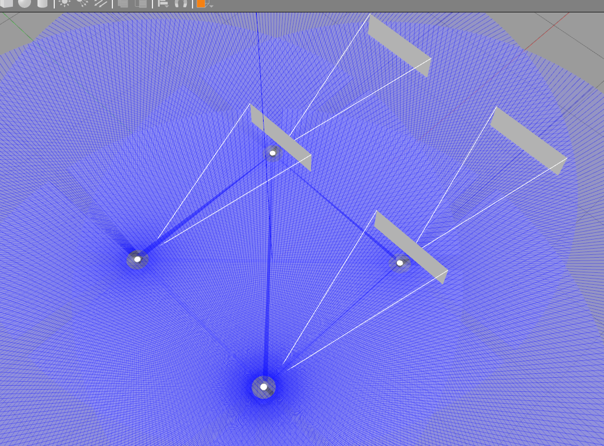

# ROS2 Multi-Robot Gazebo Package



## Overview

This ROS2 package provides a Gazebo simulation environment for multi-robot setups using the Turtlebot3 Waffle Pi robots. It is designed to replace the default `turtlebot3_gazebo` package, offering improved support for multi-robot scenarios. The package includes a world file with four Turtlebot3 Waffle Pi robots, each with its own namespaces and frame prefixes.

## Features

- Simulates four Turtlebot3 Waffle Pi robots in Gazebo.
- Properly configured namespaces and frame prefixes for each robot.
- Easy integration with ROS2 for multi-robot applications and research.

## Prerequisites

Before using this package, make sure you have the following prerequisites installed:

- ROS2 (Foxy or later) installed on your system.
- Gazebo 9 or later.
- Turtlebot3 ROS2 packages installed.

## Installation

1. Clone this repository into your ROS2 workspace:

   ```bash
   cd ~/ros2_ws/src
   git clone https://github.com/husseinalijaafar/multiple-tb3-launcher.git
   mv multiple-tb3-launcher/turtlebot3_gazebo .
   rm -rf multiple-tb3-launcher
   ```

2. Build the package using colcon:

   ```bash
   cd ~/ros2_ws
   colcon build
   ```

## Usage

1. Launch the Gazebo simulation with four Turtlebot3 Waffle Pi robots:

   ```bash
   ros2 launch turtlebot3_gazebo multi_robot_world.launch.py
   ```

2. You can now control and interact with the robots using ROS2 topics, services, and actions within their respective namespaces. For example, to control `robot1`, you can use the namespace like this:

   ```bash
   ros2 topic pub /B01/cmd_vel geometry_msgs/msg/Twist "{linear: {x: 0.2, y: 0.0, z: 0.0}, angular: {x: 0.0, y: 0.0, z: 0.0}}"
   ```

## Configuration

- The robots are configured with the following namespaces: `/B01`, `/B02`, `/B03`, and `/B04`.
- Frame prefixes for each robot are set as `B01/odom`, `B02/odom`, `B03/odom`, and `B04/odom`.

## Files and Directories

- `launch/`: Contains launch files for starting the Gazebo simulation.
- `worlds/`: Includes the Gazebo world file (`waffle_pi_multi.world`) with four Turtlebot3 Waffle Pi robots.
- `config/`: Configuration files for the robots' parameters.

## License

This package is released under the [MIT License](LICENSE).

## Acknowledgments

- This package is based on the Turtlebot3 ROS2 packages, and we acknowledge their contributions to the robotics community.

## Contributing

Contributions to this package are welcome. Please create a pull request with your changes, and we'll review them as soon as possible.

## Contact

For any questions or issues, please create an issue
---
